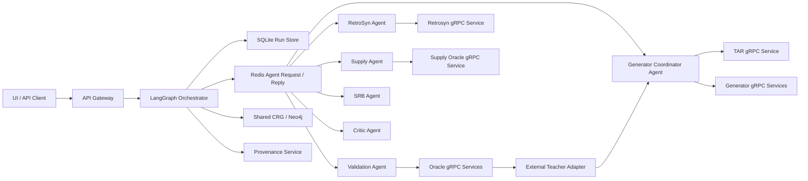

# MForge 完整主链接通方案

状态：待用户复核，禁止进入代码实施

分支：`feature/connect-full-pipeline`

## 1. 根本目标

本方案解决一个真实问题：让仓库从唯一完整设计工作流入口出发，经过真实接口契约和真实业务组件，形成可观测、可失败、可恢复、可验证的分子设计主链。

目标主链：

```text
UI/API
-> Orchestrator
-> CIG/HCIV
-> Task-Aware Router
-> Generator Coordinator
-> Generator Services
-> L0-L4 Validation Cascade
-> Candidate Selection
-> Teacher/Router Feedback
-> Retrosynthesis
-> Supply Assessment
-> SRB
-> Scientific Critic
-> Provenance and Run Persistence
```

`/v1/design` 的 seed scoring 可以保留为独立低层功能，但不能再被描述或使用为完整设计工作流。

## 2. 完成定义

只有同时满足以下条件，任务才算完成：

1. UI、Gateway、MVP client 和历史查询指向同一 Orchestrator run。
2. TAR 实际参与可用生成器选择和精确样本分配。
3. Generator Coordinator 通过真实 gRPC 契约调用所有 TAR 注册 backend，并保存候选来源。
4. L0-L4 使用公开 proto 的同一语义；required oracle 缺失、失败或跳过均不得视为通过。
5. ValidationRecord 以 `candidate_id` 为主键，只有确定选中的通过候选进入下游。
6. Validation 和 Critic 两个反馈点均按生成器来源提交幂等 Teacher/Router feedback。
7. 可训练生成模型中的教师损失必须改变可部署模型的梯度或参数；规则和检索模型不得伪称参数蒸馏。
8. RetroSyn 返回的所有 route 都有明确 supply 评估和确定性 route 选择。
9. Supply 不可用、无 route 或 Critic fail 属于科学拒绝，不得伪装为技术成功或技术失败。
10. HuMU 合成数据能完成一个真实 optimizer step、严格检查点加载和真实 gRPC 编码。
11. Synthetic smoke 最大验证级别为 L3，并经过与生产相同的协议和业务实现。
12. L4 没有外部 wet-lab evidence 时进入 `awaiting_evidence`，不得 completed。
13. 生产缺少模型、数据、命令、Redis、Neo4j 或 domain service 时明确失败，不使用静默 fallback。
14. 所有现有单元测试都被 CI 收集，不再因不完整 marker 过滤被大面积跳过。

## 3. 范围边界

### 3.1 本次范围

- 唯一完整工作流入口、运行状态、事件和错误传播。
- Agent request/reply、Agent runtime 和生产部署闭环。
- TAR、Generator Coordinator、六个 generator backend 和 Router feedback。
- 教师反馈及 HFM、FragFM、UAS、ICLM 的实际教师应用。
- 删除 CReM、MMPT 中只有指标而无模型作用的虚假 KD 语义。
- L0-L4 验证、外部 L4 evidence、候选选择和下游 route 选择。
- RetroSyn、Supply、SRB、Critic 和 provenance。
- HuMU checkpoint、ESM2 外部工件、encoder gRPC、Pareto BO 编码调用。
- HuMU Index 的独立服务契约验证。
- Python 3.12 synthetic smoke、真实进程内 gRPC、CI 和部署配置。

### 3.2 明确非目标

- 不声称合成数据能验证药物发现的科学准确性。
- 不生成或伪造真实 HuMU、ESM2、Boltz、GNINA、OpenFE、AiZynth 或商业供应数据。
- 不把 Feature Store 强行接入 HuMU；当前代码没有业务调用证据。
- HuMU Index 当前没有生产调用方，本次只修复并验证其独立服务契约，不把测试接线描述为产品主链。
- 不创建 v2、enhanced、improved 或其他平行实现。
- 不重写与完整设计主链无关的模型和 UI 功能。
- 不更新 README；完成后先说明改动，待用户确认后再处理。

### 3.3 工作包边界

为避免 50 余文件同时变更导致回归不可定位，实施拆成五个有明确检查点的工作包：

1. 运行状态与 Agent 基础设施。
2. Proto、Router、Generator 和反馈契约。
3. Validation 与 RetroSyn/Supply/SRB/Critic 纵向闭环。
4. HuMU checkpoint、合成训练和编码。
5. 各生成器教师语义与最终完整 smoke。

每个工作包完成后先代码审查和验证，再进入下一个；不创建并行版本。

## 4. 审计依据

本次只读取源码、配置、proto、测试和 Git 状态，没有读取 README、`docs/**` 既有内容或 notebook。

静态事实：

- 解析 456 个 Python 源文件，未发现语法错误。
- `tests/unit` 中识别到 756 个测试函数，但只有 39 个显式标记 `unit`。
- Makefile 和 CI 使用 `pytest tests/unit -m unit`，大量未标记测试不会执行。
- 仓库只有 `models/artifacts/manifest.json`，部署配置引用的模型工件均不存在。
- 当前主机只有系统 Python 3.9.6 和 Miniforge Python 3.13.13。
- 项目要求 Python `>=3.11,<3.13`。
- 当前主机没有 pytest、uv 或 Docker，torch、grpc、RDKit、FastAPI、LangGraph 等运行依赖未安装。

原始阻断：

```text
/Applications/Xcode.app/Contents/Developer/usr/bin/python3: No module named pytest
/Users/fwy/miniforge3/bin/python: No module named pytest
ModuleNotFoundError: No module named 'torch'
ImportError: cannot import name 'supply_pb2'
RuntimeError: Shared CRG repository missing config: NEO4J_USER, NEO4J_PASSWORD
```

## 5. 当前真实调用链与根因

### 5.1 产品入口绕过完整线路

`ui/public/app.js` 固定提交 `workflow_scope="engineering"`：

```text
UI
-> Gateway proxy
-> EngineeringWorkflowClients
-> local CIG
-> RDKitRandomGenerator
-> single RDKit validation
-> optional AiZynth
-> rule critic
```

该线路不经过 TAR、Generator Coordinator、ValidationAgent 级联、SupplyAgent 或 SRBAgent。

### 5.2 多套状态互不相通

- `/v1/design` 是独立 seed scoring。
- `/v1/reason` 使用旧 SQLite/RDKit pipeline。
- `mvp_pipeline` 返回固定 `CCO` 和固定统计。
- `/v1/orchestrator/design` 才调用 LangGraph。

UI 完成 Orchestrator 请求后却查询 `/v1/reason/runs`，因此历史记录不一致。

### 5.3 Full 分支仍主动旁路

- 默认或 `hfm_3d` 策略直接实例化 HFM servicer。
- 只有非空且非 HFM 策略才调用 GeneratorCoordAgent。
- Coordinator 不调用 TAR。
- 未传 `oracle_level` 时只调用 Boltz2，不进入 ValidationAgent。
- RetroSyn、Supply、SRB 和 Critic 由 Orchestrator 同进程直接构造。

### 5.4 Proto 与 Python 方法脱离

- Router service 有 `SubmitFeedback`、`GetWeights`，proto 未注册。
- Router 和五个 generator servicer 返回动态 Python 类型，不是 protobuf。
- ICLM `UpdateModel` 没有远程契约。
- UAS 没有 generator service。
- SupplyAgent 引用不存在的 supply proto。
- 测试直接调用 servicer 方法，绕过 gRPC 序列化。

### 5.5 静默成功掩盖真实错误

- HuMU 使用 `strict=False` 忽略 checkpoint 键不匹配。
- Validation 的 `skipped` 被判定为通过。
- 任意旧 CRG `validation_status` 可跳过更高级验证。
- Pareto BO 的 HuMU 接口错误被广泛捕获后退回 fingerprint。
- `state_only` 能记录所有阶段但没有业务产物。
- MVP runner 返回固定成功字典。

### 5.6 训练与部署语义不一致

- HFM KD 对冻结 encoder endpoint 计算，不能改变 flow model。
- FragFM KD 有训练梯度，但服务输出通常不消费模型。
- UAS 训练 autoencoder，运行时不加载或不使用。
- CReM、MMPT 只记录 KD 指标。
- ICLM generic OnlineLearner 与生产 HuggingFace runner 训练接口不兼容。

## 6. 目标架构



规则：

1. Orchestrator 是唯一控制面。
2. Agent 负责协调或业务判断，不控制整个 workflow。
3. Domain model、oracle、encoder、retrosyn 和 supply 使用 gRPC。
4. Redis 承载 Agent request/reply；生产模式禁止进程内 fallback。
5. SQLite 保存 run 和阶段事件；Neo4j 只保存 CRG evidence。
6. CRG evidence 不能直接替代当前 run 的计算结果。

## 7. 运行标识、状态和持久化

### 7.1 唯一标识

- `run_id` 是唯一主键，使用 UUID。
- `design_id` 是 HTTP 兼容别名，值必须等于 `run_id`。
- `trace_id` 是独立的分布式追踪标识。
- candidate、route、evidence、feedback 均显式保存 `run_id`。

### 7.2 状态枚举

```text
queued
running
paused
awaiting_evidence
completed
rejected
failed
interrupted
```

合法迁移：

```text
queued -> running | failed | interrupted
running -> paused | awaiting_evidence | completed | rejected | failed | interrupted
paused -> running | interrupted
awaiting_evidence -> queued | rejected | interrupted
completed -> terminal
rejected -> terminal
failed -> terminal
interrupted -> terminal
```

状态语义：

- `failed`：服务不可达、超时、协议错误、缺生产配置、程序异常。
- `rejected`：没有通过候选、无 route、供应不可用、Critic fail、refinement exhausted。
- `awaiting_evidence`：L4 需要外部证据。
- `completed`：所有本次要求的阶段都成功且 Critic pass。
- `interrupted`：服务重启导致内存 task 丢失。

### 7.3 SQLite 迁移

当前 `CREATE TABLE IF NOT EXISTS` 不会升级旧 schema，`INSERT OR REPLACE` 还可能触发级联删除。改为：

1. 使用 SQLite `PRAGMA user_version` 管理顺序迁移。
2. 为 runs 增加：
   - trace_id；
   - current_stage；
   - updated_at；
   - error_type；
   - error_message；
   - state_json；
   - runtime_profile；
   - synthetic；
   - pause_requested。
3. 使用 `INSERT ... ON CONFLICT(run_id) DO UPDATE`，禁止 `INSERT OR REPLACE`。
4. reasoning_steps 增加唯一 `(run_id, step_index)` 约束和 event type。
5. 每次迁移在事务中执行，失败回滚并阻止服务启动。

生产要求显式设置 `MF_DB_PATH`。SQLite 文件挂载独立 PVC，Orchestrator 固定单 worker、单 replica；本次不引入未要求的高可用数据库。

Synthetic smoke 使用临时 SQLite 文件并在结束后删除。

### 7.4 异步执行和事件

`POST /v1/orchestrator/design`：

1. 校验请求。
2. 在执行前写入 `queued` run。
3. 创建后台 task。
4. 返回 HTTP 202。
5. task 写入 `running` 和每个阶段事件。
6. 终态写入完整 state 和结果。

SQLite/PVC 只由 Orchestrator 进程访问。Orchestrator 提供唯一的 run 查询面：

```text
GET /v1/orchestrator/runs
GET /v1/orchestrator/runs/{run_id}
GET /v1/orchestrator/runs/{run_id}/events?after_step={step_index}
```

列表返回稳定分页结果；snapshot 返回持久化 state、当前阶段和终态结果；events 按 `step_index` 升序返回。Gateway 的 `/v1/reason`、历史详情和 SSE 路由只代理这些 Orchestrator API，不读取 SQLite、不维护第二份历史状态。UI 和 MVP client 也只消费该查询面。

SSE 不再依赖旧 pipeline 内存 Queue，而是循环调用 events API，并以 `step_index` 作为 cursor；服务重连不会丢失已写事件。

`mvp_pipeline.run_pipeline` 是 canonical API/client 的薄封装。是否使用 synthetic backend 只由测试配置决定，生产接口中不出现“调用 smoke”的特殊逻辑。

### 7.5 Pause 和服务重启

Pause 使用阶段边界 gate：

```python
await run_control.wait_if_paused(run_id)
result = await execute_stage(state)
```

- 正在执行的 domain call 不被强行截断。
- resume 释放同一进程 task。
- 服务重启后所有非终态 task 标记 `interrupted`，不伪装为 completed。

L4 `awaiting_evidence` 不使用 pause gate，使用独立证据恢复流程。

## 8. L4 evidence 和显式图路由

Validation 不再只返回布尔值，返回：

```text
PASS
FAIL
AWAITING_EVIDENCE
ERROR
```

LangGraph 路由：

```text
PASS -> retrosyn
FAIL -> refine if cycles remain, otherwise rejected
AWAITING_EVIDENCE -> persist and stop as awaiting_evidence
ERROR -> failed
```

新增 HTTP evidence 提交接口，payload 至少包含：

```text
evidence_id
run_id
candidate_id
artifact_id
artifact_checksum
source
measured_at
measurements[]:
  property
  value
  unit
  uncertainty
```

规则：

1. 只接受 `awaiting_evidence` run。
2. candidate 必须属于该 run。
3. artifact 必须在 provenance 中存在且 checksum 一致。
4. measurement 必须覆盖 L4 validation policy 中所有 required property。
5. 证据通过后加载持久化 state，更新 ValidationRecord，并从统一 post-validation gate 重新排队。
6. 证据不通过则走 FAIL 路由，不直接修改为 completed。

Synthetic smoke 最大级别固定为 L3，不生成假 wet-lab evidence。

L4 artifact 使用现有 Provenance REST 服务形成可执行闭环：

1. 先调用 `POST /v1/provenance/evidence` 上传 base64 编码的原始 evidence 和 metadata。
2. Provenance service 解码后计算 SHA-256，将原始 bytes 写入 object storage，再写 provenance record。
3. 上传返回 `artifact_id`、服务计算的 checksum 和 recorded_at；客户端提供的 checksum 只用于比对，不能覆盖服务计算值。
4. `GET /v1/provenance/artifacts/{artifact_id}` 返回 artifact type、checksum、run ID、candidate ID、source 和 recorded_at。
5. Orchestrator evidence 接口只接受上述已登记 artifact 引用，并从 Provenance service 查询后校验 run、candidate 和 checksum。
6. Provenance 不可达、artifact 不存在或 metadata 不匹配属于 ERROR；测量值真实存在但未过 threshold 属于 FAIL。

Production 必须配置 `PROVENANCE_URL`。Synthetic L3 smoke 不调用该接口；L4 contract test 使用临时 object store，测试后删除原始 evidence。

## 9. Agent request/reply

### 9.1 RedisBus

当前多个 task 同时迭代一个 PubSub listener，必须改为一个 listener 加 channel callback registry：

```text
one Redis PubSub
-> one async listener
-> dispatch by channel
-> one or more registered callbacks
```

Request 流程：

1. AgentRequestClient 生成 reply subject。
2. 先订阅 reply subject。
3. 构造带 `reply_to` 的 AgentMessage。
4. 对完整 envelope 签名后 publish。
5. 等待同 trace 和 parent message ID 的 response/error。
6. 收到或超时后执行 Redis unsubscribe 并移除 callback。

FallbackBus 实现相同 queue/request/reply 语义，不能固定返回空字节。

超时必须抛异常；不得返回 `b""`。

### 9.2 BaseAgent 响应接口

Agent 的 `process(mapping) -> mapping` 保持为唯一业务入口。BaseAgent 统一负责：

- 解析 versioned JSON payload；
- 构造 request context；
- 调用 process；
- 将 mapping 包装为 response AgentMessage；
- 捕获异常并包装为 error AgentMessage；
- 保持同一 trace_id；
- 在 lineage 写 `parent_message_id`；
- TTL 每经过一跳减一；
- 验证 recipient、trace 和 response parent ID。

Payload 固定为版本化 JSON，`payload_type_url` 使用 Agent/action/version 标识。修改 message proto 注释，不继续声称 payload 一定是 protobuf。

本地 HMAC 只视为完整性校验，不声明为身份认证。生产身份与传输边界依赖 Redis ACL/TLS；Sigstore provenance 是独立能力。除非外部签名 bundle 能跨进程验证，否则不把当前本地 signature 表述为可信身份。

Agent 内部异常必须返回 error envelope，不能终止 listener。

### 9.3 Runtime discovery

Runtime 使用现有 `moleculeforge.agents` entry-point，不维护第二份类映射。合法名称：

```text
generator_coord
validation
retrosyn
supply
srb
critic
```

命令：

```text
python -m mf_agents.runtime --agent generator_coord
python -m mf_agents.runtime --agent validation
python -m mf_agents.runtime --agent retrosyn
python -m mf_agents.runtime --agent supply
python -m mf_agents.runtime --agent srb
python -m mf_agents.runtime --agent critic
```

Runtime：

- production 使用 `allow_fallback=False`；
- 启动时连接 Redis、加载 entry point、校验该 Agent 所需 domain targets；
- 周期发布 AgentHeartbeat；
- SIGTERM 时取消订阅、等待在途请求并关闭 Redis；
- 健康检查验证 entry point、Redis 和 required target。

Compose、Helm 和 Kubernetes 增加六个独立 workload。Orchestrator 只配置 Agent subjects 和 timeout；Router、generator、oracle、retrosyn、supply targets 配置在相应 Agent runtime。

LangGraph 到 Agent 的生产映射固定如下：

| Graph node | Redis subject | action/type URL | request state | result state | outcome |
|---|---|---|---|---|---|
| generating | `agent.generator_coord.request` | `generator_coord/generate/v1` | run/request ID、CIG、HCIV、IntentCone、sample policy | candidates、allocations、artifact refs | success/error |
| validating | `agent.validation.request` | `validation/validate/v1` | candidates、ValidationPolicy、target context | ValidationRecord、evidence refs | pass/fail/awaiting/error |
| retrosyn | `agent.retrosyn.request` | `retrosyn/plan/v1` | selected candidate | all routes | success/empty/error |
| supply | `agent.supply.request` | `supply/assess/v1` | all routes/building blocks | per-route assessments | available/blocking/error |
| srb | `agent.srb.request` | `srb/compile/v1` | selected candidate/route/evidence | SRBRecord | success/error |
| critic | `agent.critic.request` | `critic/evaluate/v1` | complete evidence including blocking evidence | CriticRecord | pass/fail/error |

每个 result schema 都必须返回 run ID、request ID 和版本。`FullWorkflowClients` 只保留 domain client 配置数据，不再保存或实例化 Agent/servicer。Full production graph 禁止直接 Python 调用 Agent；local synthetic 也经过 FallbackBus 的同一 request/reply envelope。兼容 subscription alias 可保留，但 Orchestrator 只发布表中的 canonical subject。

## 10. Router 输入、可用性和样本分配

### 10.1 Proto 兼容

保留 RouterRequest 现有字段编号，只追加：

```text
request_id = 14
available_generator_names = 15
task_complexity = 16
```

`task_complexity` 使用明确枚举：

```text
UNSPECIFIED
LOW
MEDIUM
HIGH
```

原始 objectives 不直接进入 TAR。TAR 使用现有 TaskProfile 字段和 task complexity。

`n_samples` 和 `n_select` 必须都大于零，否则返回 `INVALID_ARGUMENT`。

为保持现有行为但消除 Coordinator 静态选路：

- LOW：HFM 可用时只允许 HFM。
- MEDIUM/UNSPECIFIED：使用学习权重。
- HIGH：只允许现有 refinement generator 集合。

该规则只存在于 TAR，不在 Coordinator 复制。

### 10.2 Availability 在 Route 之前

Coordinator 先并发调用所有配置 backend 的 `Info`：

- 调用成功；
- name 与配置一致；
- `runtime_status == READY`；
- 所有 required `ArtifactRef` 均有非空 version/checksum；
- max_batch_size 大于零。

只有通过检查的名字进入 `available_generator_names`。没有可用生成器属于技术失败。

### 10.3 确定性分配算法

给定 `n_samples`、`n_select` 和可用正权重生成器：

1. `k = min(n_select, n_samples, available_positive_weight_count)`。
2. 按 weight 降序、canonical generator order 稳定排序，选择 top-k。
3. 每个选中 generator 先分配 1。
4. 将剩余 `n_samples - k` 按选中权重重新归一化。
5. 使用 largest-remainder method 分配整数余量。
6. 余数相同时按 canonical generator order。

必须满足：

```text
sum(allocation.n_samples) == n_samples
allocation.n_samples > 0
len(allocations) == k
```

新增：

```text
GeneratorAllocation:
  generator_name = 1
  n_samples = 2
  normalized_weight = 3
  expected_reward = 4

RouterResponse:
  allocations = 5
  warnings = 6
  state_version = 7
```

RouterResponse 保留现有字段；deprecated request 字段被提供时通过 warnings 明确返回。

如果 complexity 过滤后没有 READY 且正权重的 generator，或所有允许权重为零，则返回 `FAILED_PRECONDITION`，不得返回空 allocation。

Coordinator 按 `GeneratorInfo.max_batch_size` 将单 generator allocation 切成顺序 batch；不同 generator 并发。每个 chunk 保存：

```text
chunk_id = SHA256(request_id | generator_name | chunk_index)
chunk_seed = first_uint64(SHA256(base_seed | request_id | generator_name | chunk_index))
```

每个 generator 返回数量必须严格等于 allocation，合计不足时 generation stage 技术失败，不保留部分成功。chunk ID、seed 和 artifact refs 写入 candidate provenance，禁止分块复用同一 seed。

## 11. Router state 和 feedback

### 11.1 完整状态

Router state 保存：

- 完整 `TaskAwareRouter.state_dict()`；
- KD layer state；
- oracle history；
- generator canonical order；
- hciv/task/hidden dimensions；
- state schema version；
- monotonically increasing state version；
- processed feedback IDs；
- bootstrap metadata。

`SubmitFeedback` 和 `RunProxylessSearch` 都会修改并持久化状态。

现有 `RouterRequest.generator_performance` 字段只为 wire compatibility 保留并标记 deprecated。Route 对非空字段完成长度/有限值校验后返回 warning，但不读取它改变权重，也绝不修改 oracle history；历史只允许通过幂等 `SubmitFeedback` 更新。

更新过程使用进程内锁：

```text
lock
-> apply update
-> write temp file
-> fsync temp file
-> atomic replace
-> fsync parent directory
-> unlock
```

Route、GetWeights、SubmitFeedback 和 RunProxylessSearch 使用同一个锁。只读 RPC 在锁内取得完整 state/version 一致快照后计算，不能同时观察更新前后的混合状态。

Router production 固定单 replica，state path 挂载独立可写 PVC，不与只读模型工件目录混用。

首次启动只有显式 `TAR_BOOTSTRAP=true` 才允许随机初始化并保存；否则缺 state 文件启动失败。Synthetic smoke 显式 bootstrap 并使用临时目录。

### 11.2 GetWeights 语义

权重依赖 HCIV 和 TaskProfile，因此 GetWeights request 必须携带与 Route 相同的 context。前后比较对同一 context 重算权重，同时返回 state version；不再把 zero-HCIV/default profile 当作全局 route 结果。

在现有 GeneratorRouterService 追加：

```text
rpc SubmitFeedback(RouterFeedbackRequest) returns (RouterFeedbackResponse)
rpc GetWeights(RouterRequest) returns (RouterWeightsResponse)
```

RouterFeedbackResponse 返回 `acknowledged`、`duplicate` 和 `state_version`。RouterWeightsResponse 按 canonical order 返回 generator names、weights 和 state version。

### 11.3 Feedback 契约

RouterFeedbackRequest 至少包含：

```text
feedback_id
run_id
request_id
iteration
phase: VALIDATION | CRITIC
generator_name
candidate_ids[]
canonical_smiles
evidence_ids[]
teacher_score
teacher_source
teacher_version
synthetic
```

`teacher_score` 在 protobuf 中使用 `optional double`，使合法 `0.0` 与“缺失”可区分。

`feedback_id` 由 run、iteration、phase、generator、canonical SMILES 和 evidence version 确定性生成，用于幂等。

执行方：

- Orchestrator 在 validation outcome 确定后，向 Generator Coordinator Agent 提交 VALIDATION feedback。
- Orchestrator 在 Critic outcome 确定后，向 Generator Coordinator Agent 提交 CRITIC feedback。
- Coordinator 是唯一 Router feedback RPC 调用方。

Orchestrator 只提交原始 ValidationRecord/CriticRecord、evidence IDs 和 teacher policy，不执行 teacher command。Coordinator 是唯一 teacher adapter owner：

1. 以证据调用配置的 command/URL；
2. 校验 response 的 score presence、有限值、范围、source 和 version；
3. 按 adapter manifest 中的固定归一化规则得到 score；
4. 组装 RouterFeedbackRequest 并调用 Router。

Adapter 未返回 `teacher_score`、source 或 version 时视为 unavailable，不将 protobuf 默认值当作零分。

同一 generator 的重复 canonical SMILES 在同一 phase 只计一次；不同 generator 生成同一 SMILES 时分别反馈。

`teacher_policy` 是 full request 的显式必填字段：

- `required`：teacher 缺配置、无合法分数或版本不明，当前阶段技术失败。
- `optional`：记录 feedback unavailable，不更新 Router，不导致技术失败。

Validation 和 Critic 分别产生独立 feedback ID。超时重试不会重复计数。

## 12. Generator proto 和服务

### 12.1 Generator contract

保留现有字段编号，追加：

- `GenerateRequest.request_id = 10`；
- `GenerateRequest.cig = 11`，类型为 `moleculeforge.v1.core.CIG`；
- `GenerateRequest.hciv = 12`，类型为 `moleculeforge.v1.core.HCIV`；
- `GenerateRequest.context_schema_version = 13`；
- `GenerateResponse.request_id = 7`；
- `GenerateResponse.artifacts = 8`，类型为 repeated `ArtifactRef`；
- `GenerateResponse.molecule_payload_schema = 9`；
- `GenerateResponse.embedding_payload_schema = 10`。

现有 `intent_cone` bytes 必须严格反序列化为 `moleculeforge.v1.core.IntentCone`。HCIV 必须为 129 个有限坐标、曲率与 IntentCone 一致且位于 Lorentz manifold；CIG 必须通过 CIG validator，project ID 与 request 一致。MMPT、UAS 和其余 backend 均从同一 GenerateRequest 收到完整 CIG/HCIV，不允许 Coordinator 丢字段或重建简化对象。

在现有 `core/audit.proto` 追加共享契约：

```text
moleculeforge.v1.core.ArtifactRef:
  name = 1
  version = 2
  checksum = 3
  required = 4

GeneratorRuntimeStatus:
  UNSPECIFIED
  READY
  UNAVAILABLE
```

GeneratorInfo 向后兼容追加 `runtime_status = 9`、`status_message = 10` 和 repeated `moleculeforge.v1.core.ArtifactRef artifacts = 11`。每个 backend 的 artifacts 是其完整 runtime manifest 中所有模型、索引、decoder 和规则工件，不再用一个字符串代表多工件复合状态。

当前 `molecules` 实际是 JSON bytes，不是 Molecule protobuf。保持字段兼容并固定 schema 为 versioned JSON，服务和 client 同时严格校验。

`humu_embeddings` 中每条记录为 packed float32 bytes；有值时数量必须等于 molecules 数量。

五个现有 generator servicer 和新增 UAS servicer 全部返回真实 `generator_pb2.GenerateResponse`。

Contract test 必须校验：

- request ID；
- generator name；
- 完整 artifact refs；
- CIG/HCIV/IntentCone 传输与校验；
- Info runtime/artifact status；
- payload schema；
- 返回数量；
- JSON 解码；
- gRPC serialization round-trip。

### 12.2 UAS GeneratorService

新增 UAS generator service，移除 TAR 生产路径中的 `python://` 例外。

Production UAS 必须配置：

```text
UAS_AUTOENCODER_PATH
UAS_ARTIFACT_MANIFEST_PATH
UAS_CANDIDATE_SOURCE_COMMAND
UAS_DECODER_COMMAND
```

契约：

- candidate source 输出 `N x dim` float embedding。
- manifest 声明 dim、latent dim、checkpoint version 和 checksum。
- autoencoder state 与 manifest 严格匹配。
- decoder 接受已选 embedding，返回等量合法 molecule JSON。
- estimator 使用逐样本 `mean((candidate - autoencoder(candidate))**2)` 作为 reconstruction unfamiliarity；加载 AE 时 reference 不参与该公式。
- safety probability 实际决定接受集合。

旧 reference embedding 仅属于无 AE 的 local compatibility 算法，不能成为 production required artifact，也不能与 reconstruction unfamiliarity 混合而不声明。

现有直接返回最终 SMILES 的 runner 只保留为明确的 local compatibility mode，不注册为 production available backend。

## 13. 教师应用语义

### 13.1 推理期 teacher feedback

```text
validation or critic evidence
-> Generator Coordinator
-> external teacher adapter owned by Coordinator
-> normalized score with source/version
-> Router SubmitFeedback
```

当前内部分数归一化 endpoint 只能称为 adapter，不能称为 HypSeek 模型。Production 只有配置真实外部 command/URL 时才声明 HypSeek teacher。

Synthetic 使用确定性 teacher records，并在 response、feedback 和 provenance 标记 `synthetic=true`。

### 13.2 HFM 逐样本 Lorentz KD

Teacher artifact 必须逐样本对齐，包含：

```text
sample_id
canonical_smiles
teacher_endpoint[129]
curvature
teacher_checkpoint_version
```

禁止把二维 teacher batch 求全局均值。

对每个训练 batch：

1. 根据 sample_id 对齐 teacher endpoint。
2. 校验 129 维、有限值、curvature 和 Lorentz manifold。
3. 采样同一 `t`，限制 `0 <= t <= 1 - epsilon`，得到 `x_t`。
4. 计算：

```text
v_teacher = logmap(x_t, teacher_endpoint) / (1 - t)
v_pred = compute_vector_field(x_t, t)
kd_loss = tangent_space_loss(v_pred, v_teacher)
```

`compute_vector_field` 必须走模型现有的拼接输入和 `project_tangent`，使 v_pred 与 v_teacher 位于同一 `x_t` 的切空间。KD 梯度必须进入 velocity_net。

测试固定 batch、t 和随机种子，比较 `kd_weight=0` 与非零时 velocity_net gradient/parameter delta；不能只比较正常训练前后参数。

### 13.3 FragFM

Teacher KD 继续作用于 fragment encoder。Runtime 对每条 assembly rule：

1. 构造规则 fragment token 序列。
2. 计算目标 token 的平均 log-likelihood。
3. 从 artifact manifest 读取显式 `model_score_weight`。
4. `rule_score = rate_transition_score + model_score_weight * mean_log_likelihood`。
5. 分数相同时按 rule ID 稳定排序。

Production full 模式缺 checkpoint 或 model_score_weight 时启动失败。Local demo 可不使用模型，但不得声明 teacher/KD 生效。

### 13.4 UAS

UAS 训练保存的 autoencoder 在 runtime 严格加载，并实际参与 reconstruction unfamiliarity。Teacher KD 是否改变接受集合由固定 candidate embeddings 测试验证。

### 13.5 CReM 和 MMPT

这两个生成器当前没有可训练 teacher 路径：

- CReM 保留现有 docking、pharmacophore 和 HuMU scorer，它们是领域排序器，不称为 KD。
- MMPT 保留 retrieval/contrastive score，不新增未经证明的 teacher scorer。
- 删除或重命名训练 CLI、manifest 和测试中只计算指标却声称 KD 的字段。
- 两者仍通过 Validation/Critic teacher score 参与 Router 在线反馈，但不声明生成模型参数被蒸馏。

### 13.6 ICLM

本次不把 generic OnlineLearner 强行接到不兼容的 HuggingFace runner。

Production 要求真实 `ICLM_UPDATE_COMMAND`。新增独立 `IncrementalGeneratorService`，与 GeneratorService 注册在同一 gRPC server。

ModelUpdateRequest 包含：

- run/request ID；
- versioned training batch payload；
- packed teacher embeddings；
- rows/dim；
- teacher source/version；
- target checkpoint version。

更新成功：

1. service 在 `ICLM_STAGING_ROOT/{request_id}` 创建 staging 目录并把该明确路径传给 command；
2. command 只能向该 staging 目录输出新 checkpoint；
3. 校验模型、tokenizer、version 和所有 artifact checksum；
4. 在独占更新锁内构造新的 immutable runner；
5. 原子切换 active version pointer 和 active runner 引用；
6. 旧 Generate 请求继续使用已捕获的旧 runner，新请求只取得新 runner，不观察混合 tokenizer/model；
7. 成功后清理旧 cache 和 staging；失败时保持 active pointer 不变并清理 staging；
8. 返回实际 active version 和 artifact refs。

Generate 只在短锁内捕获 `(runner, version, artifact refs)` 一致快照，推理不长期占用更新锁。

Generic OnlineLearner 只用于显式注入的单元测试，不声称是 production updater。

## 14. Validation policy 和 Oracle contract

### 14.1 级别映射

HTTP 内部级别和 protobuf 枚举显式映射：

```text
0 -> L0_RDKIT (proto value 1)
1 -> L1_ML_SURROGATE (proto value 2)
2 -> L2_DOCKING (proto value 3)
3 -> L3_FEP (proto value 4)
4 -> L4_WETLAB (proto value 5)
```

不依赖数值加一的隐式假设，使用固定 mapping。

### 14.2 ValidationPolicy

Full HTTP/API request 是 policy 的唯一权威来源，必须显式提供：

```text
validation_policy:
  max_level
  thresholds[]:
    property
    comparator: MIN | MAX
    value
    unit
  required_oracles[]
  protein_pdb_id or receptor_uri
  reference_ligand_smiles
teacher_policy: required | optional
selection_policy:
  criteria[]:
    metric
    direction: MIN | MAX
    priority
```

UI 必须采集这些字段；MVP client 和 synthetic fixture 必须显式传入。CIG 只编译自然语言科学意图，不生成阈值、oracle、teacher 或 selection policy。请求缺 policy 必填字段时在创建 run 前返回 HTTP 422。run 创建后，Orchestrator 在 CIG 编译阶段校验 policy property 能映射到 CIG objectives；语义矛盾记录 `invalid_policy` evidence 并使 run rejected。两种情况都不设置隐式默认值。

### 14.3 各级语义

| 级别 | Required 实现 | 启用条件 |
|---|---|---|
| L0 | RDKit validity/physchem | 总是 |
| L1 | ADMET service | 请求 L1 以上 |
| L1 | Boltz2 surrogate | policy 含 affinity property |
| L2 | Dock service | 请求 L2 以上，且有 receptor |
| L3 | FEP service | 请求 L3 以上，且有 reference ligand |
| L4 | 外部 evidence | 请求 L4 |

每个 threshold 明确 property、单位、方向和值。现有 `scores`、`uncertainties`、`success` 和 `error_message` 字段保留以兼容旧 client；追加：

```text
OracleMetric:
  property = 1
  value = 2
  unit = 3
  optional uncertainty = 4

OracleEvaluation:
  outcome = 9: PASS | FAIL | SKIPPED | ERROR
  oracle_version = 10
  model_version = 11
  artifact_refs = 12
  evidence_id = 13
  metrics = 14
  error_code = 15
```

`success=true` 表示 oracle 执行完成，可对应 PASS 或 FAIL；ERROR/SKIPPED 必须为 false。不得用空 metrics、`success=false` 或默认 score 猜测 outcome。

OracleBatchRequest 向后兼容追加：

- receptor URI = 6；
- protein PDB ID = 7；
- reference ligand SMILES = 8；
- versioned oracle parameters = 9；
- request ID = 10。

不再从全局环境读取逐 run receptor 或 reference ligand。

### 14.4 执行规则

1. max level 必须在 0 到 4。
2. level 严格顺序。
3. 同一级独立 oracle 批量并发。
4. 候选之间有界并发。
5. 任一级 FAIL 停止该候选更高级计算。
6. required service 未配置/不可达、timeout、协议错误、`success=false`、SKIPPED 或缺必需 metric 固定返回 ERROR。
7. Oracle 真实返回全部必需 metric，但任一 metric 不满足 threshold 时固定返回 FAIL。
8. L4 无 evidence 返回 AWAITING_EVIDENCE。
9. CRG 只写 evidence，不直接跳过当前计算。
10. Validation、RetroSyn、Supply 和 Critic 现有无版本 shortcut 全部取消；后续如需 cache，必须包含 config/evidence/artifact version。

## 15. Candidate 关联和选择

### 15.1 CandidateRecord

每个 generation result 生成唯一 candidate ID，并保存：

```text
candidate_id
run_id
request_id
iteration
canonical_smiles
generator_name
generation_id
router_weight
artifact_refs[]
synthetic
```

ValidationRecord 必须以 candidate ID 为主键，不以 SMILES 为主键。

同一 canonical SMILES 的 oracle 计算可在当前 run 内去重，但 evidence 通过 `evaluation_group_id` 回填到所有 candidate ID。Feedback 对同一 generator/canonical/phase 只计一次；不同 generator 分别计入。

### 15.2 SelectionPolicy

不使用未接通的“现有 Pareto selector”。Full request 的 `selection_policy` 必须给出有序 criteria：

```text
metric
direction: MIN | MAX
priority
```

选择规则：

1. 只考虑满足全部 required validation 的 candidate。
2. 缺任一 selection metric 的 candidate 不合格。
3. 按 priority 从高到低做稳定 lexicographic sort。
4. 同值按 canonical SMILES，再按 candidate ID。
5. 保存唯一 `selected_candidate_id`。

无法形成有效 selection policy 时 run rejected，不猜测目标或权重。

## 16. Retrosyn、Supply、SRB 和 Critic

完整基数：

```text
selected_candidate_id
-> route_id[]
-> each route supply assessment
-> selected_route_id
-> optional SRBRecord
-> CriticRecord
```

### 16.1 Route 选择

对 RetroSyn 返回的所有 route 执行 supply assessment。

Supply 状态：

```text
available
partial
unavailable
```

只有 `available` route 能进入 SRB。`partial` 和 `unavailable` 均作为 blocking evidence。

可用 route 的稳定选择顺序：

1. predicted score 降序；
2. predicted yield 降序；
3. estimated cost 升序；
4. step count 升序；
5. route ID 字典序。

### 16.2 下游分支

- 无 route：跳过 Supply/SRB，仍执行 Critic，最终 rejected。
- 全部 supply partial/unavailable：跳过 SRB，仍执行 Critic，最终 rejected。
- 有 available route：选择 route，执行 SRB，再执行 Critic。
- Critic fail 且仍有 refinement cycle：先提交 CRITIC feedback，再 refine。
- Critic fail 且 cycle exhausted：rejected。
- Domain service 异常：failed。

Critic 必须收到 route/supply/SRB 的 blocking evidence。Supply unavailable 时不能跳过 Critic，否则供应 blocking rule 永远不会执行。

补齐 Supply proto，Supply servicer 返回真实 protobuf。Synthetic 使用临时只读 catalog 和临时 RetroSyn command，实际经过 gRPC parser；所有临时文件结束后删除。

`supply.proto` 契约固定为：

```text
AvailabilityRequest:
  smiles = 1
  request_id = 2

AvailabilityResponse:
  smiles = 1
  available = 2
  catalog_id = 3
  catalog_source = 4
  source_timestamp = 5
  optional price = 6
  currency = 7
  optional lead_time_days = 8
  evidence_id = 9
  catalog_version = 10
  catalog_checksum = 11

BatchAvailabilityRequest:
  requests = 1
  request_id = 2

BatchAvailabilityResponse:
  results = 1
  total_elapsed_ms = 2
  request_id = 3

CatalogPriceRequest:
  smiles = 1
  catalog_id = 2
  request_id = 3

SupplyOracleService:
  CheckAvailability
  BatchCheck
  GetCatalogPrice
```

缺 catalog 配置返回 `FAILED_PRECONDITION`；非法 SMILES/request 返回 `INVALID_ARGUMENT`；backend 不可达返回 `UNAVAILABLE`；deadline 返回 `DEADLINE_EXCEEDED`。catalog 中查不到合法 building block 是正常业务结果 `available=false`，不是 RPC error。price 和 lead time 使用 optional presence；currency 在 price 存在时必填。Batch 保持输入顺序并返回等量结果。

## 17. HuMU checkpoint

### 17.1 Schema

保留实际 encoder 键名：

```text
checkpoint_schema_version
checkpoint_version
model_config
encoder_mol
encoder_pocket
encoder_route
encoder_protac_feature
encoder_protac_context_feature
optimizer
scheduler
training_state
external_artifacts
```

`checkpoint_schema_version` 表示文件格式；`checkpoint_version` 是不可变模型版本。文件外 manifest 保存 SHA-256。

`model_config` 不是原始训练 YAML 的任意副本，而是构造模型所需的规范化 schema：

```text
manifold_dim
curvature
learnable_curvature
encoders:
  mol:
    dim, hidden_dim, n_layers, n_heads, dropout, use_3d_geometry
    wrapper: enabled, input_dim, output_dim
  pocket:
    dim, hidden_dim, n_layers, n_heads, dropout
    radius_angstrom, max_neighbors, use_3d_geometry
    use_esm2, esm2_layer, esm2_dim, esm2_batch_tokens
    esm2_max_sequence_length, esm2_required_sources
    wrapper: enabled, input_dim, output_dim
  route:
    dim, hidden_dim, n_layers, n_heads, dropout, use_tree_pooling
    wrapper: enabled, input_dim, output_dim
  protac_feature:
    input_dim, hidden_dim, dropout, output_dim
  protac_context_feature:
    input_dim, hidden_dim, dropout, output_dim
```

训练保存的是规范化后的实际值，不保存依赖默认构造器才能补齐的缺省项。Encoder service 必须先按该配置构造三个 concrete encoder 和同结构 wrapper，再 strict load；synthetic 的小 hidden/layer 配置不得被服务端默认 128/默认层数覆盖。

training_state 明确包含：

```text
epoch
global_step
epoch_step
n_batches
best_loss
epoch_loss_sum
epoch_loss_count
checkpoint_type
```

旧键只有在无歧义时迁移；不得用 `strict=False` 掩盖 missing/unexpected keys。

### 17.2 依赖边界

`mf_humu.training.encoder_checkpoint` 只提供：

- 通用 EncoderWrapper；
- schema validation；
- strict state loading；
- save/load helpers。

它不导入 `mf_encoders`，不违反 libs 依赖层级。

Pipeline 和 Encoder service 各自导入 concrete encoder class，并调用同一个 wrapper/helper。公共 wrapper 暴露 `.manifold` 和 `.curvature` 属性，避免当前 `_manifold`/`manifold` 不一致。

新增 `mf_humu/training/__init__.py`。

训练配置中的相对 data、output、resume 和 external artifact 路径统一相对配置文件所在目录解析并立即规范化为绝对路径；绝不相对调用者当前工作目录。仓库默认配置删除固定 `/workspace/MForge/...` 前缀。显式绝对路径保持原值。

### 17.3 ESM2

HuMU checkpoint 不内嵌 ESM2 权重。`external_artifacts` 保存：

```text
esm2_path
esm2_version
esm2_checksum
```

Production `use_esm2=true` 时，训练和服务启动都严格校验独立 ESM2 artifact。Synthetic 显式 `use_esm2=false`；另有缺 ESM2 的负向测试。

### 17.4 Encoder proto

EncodeResponse 向后兼容追加：

- checkpoint version = 4；
- checkpoint checksum = 5；
- embedding dimension = 6。

服务校验请求中的 checkpoint version；与 active version 不一致时返回明确 gRPC status。

### 17.5 下游严格消费

HFM、FragFM、HuMU Encoder service 和训练 resume 使用同一个 checkpoint helper：

1. 读取并校验 schema/version/checksum。
2. 从 `model_config.encoders.mol` 构造 concrete molecule encoder。
3. 根据 wrapper 配置构造与训练期相同的 projection。
4. 对完整 `encoder_mol` state strict load。
5. 推理实际经过 `inner -> projection -> manifold project`。

禁止剥离 `inner.` 前缀、丢弃 `proj.*`、直接加载 raw encoder 或使用 `strict=False`。HFM/FragFM 各自的 artifact refs 保存 HuMU checkpoint version/checksum。

## 18. HuMU synthetic smoke

Synthetic 保持 `manifold_dim=128`，因此输出固定 129 维。只缩小：

- hidden size；
- layer count；
- head count；
- data record count。

配置：

- 关闭 ESM2；
- CPU；
- `steps_per_epoch=1`；
- batch size 等于正权重 objective 数量，当前为 11；
- 11 个 positive objective 的 synthetic sampling ratio 全部显式设为 `1.0`，保证 largest-remainder quota 每项恰好为 1；
- `skip_bad_batches=false`；
- 单 epoch；
- 所有临时 source 满足 loader schema。

这 11 项固定为：

```text
mol_self
mol_pocket
mol_route
mol_pocket_route
activity_pair
protac_component
protac_component_library
route_template
protac_ternary
protein_interface
interface_mutation
```

必须断言：

1. 恰好执行一个 optimizer step。
2. batch 的 objective count map 精确包含 11 个 positive objective，且每项为 1。
3. 至少一个可训练参数发生变化。
4. checkpoint `global_step == 1`。
5. training state 完整。
6. 服务严格加载该 checkpoint。

Encoder 验证必须启动真实进程内 gRPC server 并通过 generated stub 调用，不能直接调用 servicer。响应检查：

- embedding bytes 长度 516；
- `struct.unpack` 得到 129 个 float32；
- 全部有限；
- 满足 Lorentz manifold；
- version/checksum 正确。

Synthetic 数据、checkpoint、ESM2-disabled config 和 SQLite 均使用临时目录并在测试结束删除。

## 19. HuMU Index 独立契约

Index 不属于当前产品主链，但服务本身必须正确。

Qdrant 两阶段检索：

1. API 接受 129 维 Lorentz point 和 checkpoint version。
2. 校验 manifold。
3. log-map 到原点切空间的 128 维向量。
4. Qdrant ANN 使用 Euclidean，不使用 Cosine。
5. `candidate_k` 必须大于 `top_k`。
6. payload 保存原始 129 维 point、entity ID 和 checkpoint version。
7. 对 candidate_k 结果使用准确 Lorentz distance 重排。
8. 返回 `ann_score` 和 `lorentz_distance`。

Collection 以 checkpoint version 隔离。连接时校验现有 collection 的维度和 Euclidean distance，不按名字盲目复用。

`app.state` 以 collection key 缓存 client，不能只缓存第一个 collection。

现有 DKI 测试中的非 Lorentz 假向量必须替换为合法构造。

验证结果分层报告：

- unit：注入 fake client，只验证转换、oversampling 和 rerank，不声明 Qdrant 集成通过；
- local integration：使用 qdrant-client local in-memory mode，明确标记为 local mode；
- deployment integration：连接真实 `QDRANT_URL` 服务，验证 collection schema 和 CRUD；环境不可用时报告“未执行”，不得记为通过。

## 20. Pareto BO 与 HuMU

Pareto provider 使用真实：

```text
encoder_pb2.EncodeRequest(entity_type, input_data, checkpoint_version)
HUMUEncoderServiceStub
```

`humu_embedding` 是 packed float32 bytes，必须 `struct.unpack`，并校验维度、有限值、manifold 和 version。

配置了 HUMU provider 时错误必须向上传播。Fingerprint 只能由显式 provider selection 启用，不能由广泛异常 fallback 启用。

TangentSpaceNoiseCandidateProvider 必须：

```text
Lorentz point
-> log-map
-> tangent noise
-> exp-map
-> valid Lorentz point
```

禁止直接对 129 维 Lorentz coordinate 加欧氏噪声。

## 21. Artifact 和部署状态

Static artifact manifest 增加：

- artifact version；
- checksum；
- UAS autoencoder/decoder/candidate source；
- ESM2；
- teacher source/version；
- ICLM active model requirements。

Generator response 的 repeated artifact refs 来自已校验 manifest 或 checkpoint，不由服务临时编造。

Mutable state：

- Router：`/var/lib/moleculeforge/router/state.pt` 独立 PVC，单 replica。
- Orchestrator：`/var/lib/moleculeforge/orchestrator/runs.db` 独立 PVC，单 replica。
- ICLM：独立 active versions 目录和原子 pointer。

部署修复：

- Docker base tag 与 build script 统一。
- Dockerfile 版本约束加引号，避免 shell 重定向。
- 镜像安装实际 workspace packages。
- Compose/Helm/Kubernetes 增加六个 Agent workload 和 UAS service。
- 各 Agent 只接收所需 domain target。
- Minimal compose 模块入口改为 `.main`，端口与服务一致。
- 移除把内部分数归一化服务冒充 HypSeek 的默认连接。
- 配置 Neo4j URI/user/password。
- 为 Orchestrator 注入 `PROVENANCE_URL`，为 Provenance service 配置 object-store endpoint。
- 为 HuMU Index 的 Compose、Helm 和 Kubernetes workload 注入 `QDRANT_URL`，并让 health check 实际连接该 endpoint。
- 配置 run-store、Router-state 和 ICLM PVC。
- CI 直接执行全部 `tests/unit`，不使用不完整的 `-m unit` 过滤。

本地主机无 Docker，因此最终只声明 Python/in-process gRPC 验证结果；Compose 只做解析和引用检查，不伪报容器运行成功。

## 22. 错误传播

```text
Domain service error
-> Agent error envelope
-> Workflow ERROR outcome
-> Persist failed stage and original error
-> Gateway stable error body
-> UI displays stage and message
```

禁止：

- 把 upstream 原始错误隐藏成无信息 502；
- 捕获接口错误后自动切换算法；
- 缺 artifact 时生成固定候选；
- required oracle skipped 后继续；
- run 失败前不持久化；
- 科学拒绝使用 `failed`；
- 技术异常使用 `rejected`。

## 23. 并发和性能

- Generator Info 并发探测。
- 不同 generator 并发，单 generator 超过 max batch 时顺序分块。
- Validation 按 level 批量调用 oracle。
- 候选并发有配置上限。
- 低级失败立即停止。
- Router 一次 Route 完成选择和分配。
- Router update 使用单锁和单原子写。
- Run/result 使用批量数据库写。
- HuMU 使用 BatchEncode。

不增加新 cache。当前 CRG shortcut 缺 version key，最简单正确做法是先取消决策短路。

## 24. 文件影响评估

实施发现额外文件时必须先说明原因，不得擅自扩大范围。

### 24.1 入口、状态和编排

- `ui/public/app.js`
- `services/api-gateway/src/api_gateway/main.py`
- `services/api-gateway/src/api_gateway/routers/reason.py`
- `services/api-gateway/src/api_gateway/routers/design.py`
- `services/api-gateway/src/api_gateway/routers/stream.py`
- `services/orchestrator-svc/src/orchestrator_svc/main.py`
- `services/orchestrator-svc/pyproject.toml`
- `agents/orchestrator/src/orchestrator/workflow/graph_builder.py`
- `agents/orchestrator/src/orchestrator/pipeline.py`
- `pipelines/mvp_pipeline/src/mvp_pipeline/runner.py`
- `libs/mf-core/src/mf_core/db/store.py`

### 24.2 Agent

- `protos/moleculeforge/v1/agent/message.proto`
- `libs/mf-agents/src/mf_agents/base/agent.py`
- `libs/mf-agents/src/mf_agents/messaging/redis_bus.py`
- `agents/generator_coord/src/generator_coord/agent.py`
- `agents/validation_agent/src/validation_agent/agent.py`
- `agents/retrosyn_agent/src/retrosyn_agent/agent.py`
- `agents/supply_agent/src/supply_agent/agent.py`
- `agents/srb_agent/src/srb_agent/agent.py`
- `agents/critic_agent/src/critic_agent/agent.py`

新增：

- `libs/mf-agents/src/mf_agents/runtime.py`
- `libs/mf-agents/src/mf_agents/messaging/request_client.py`

### 24.3 Proto 和 services

- `protos/moleculeforge/v1/generator/router.proto`
- `protos/moleculeforge/v1/generator/generator.proto`
- `protos/moleculeforge/v1/oracle/oracle.proto`
- `protos/moleculeforge/v1/humu/encoder.proto`
- `protos/moleculeforge/v1/core/audit.proto`
- `protos/moleculeforge/v1/core/molecule.proto`
- 新增 `protos/moleculeforge/v1/oracle/supply.proto`
- 对应 `libs/mf-core/src/mf_core/proto_gen/**`
- `services/generator-router-svc/src/generator_router_svc/main.py`
- `services/hfm-generator-svc/src/hfm_generator_svc/main.py`
- `services/fragfm-generator-svc/src/fragfm_generator_svc/main.py`
- `services/crem-generator-svc/src/crem_generator_svc/main.py`
- `services/mmpt-generator-svc/src/mmpt_generator_svc/main.py`
- `services/iclm-svc/src/iclm_svc/main.py`
- `services/humu-encoder-svc/src/humu_encoder_svc/main.py`
- `services/humu-encoder-svc/pyproject.toml`
- `services/humu-index-svc/src/humu_index_svc/main.py`
- `services/supply-oracle-svc/src/supply_oracle_svc/main.py`
- `services/provenance-svc/src/provenance_svc/main.py`

新增 UAS service：

- `services/uas-generator-svc/pyproject.toml`
- `services/uas-generator-svc/src/uas_generator_svc/__init__.py`
- `services/uas-generator-svc/src/uas_generator_svc/main.py`

### 24.4 Router 和生成模型

- `libs/mf-core/src/mf_core/routing/task_router.py`
- `libs/mf-core/src/mf_core/routing/cross_paradigm_kd.py`
- `models/mf-generators/hfm_3d/train.py`
- `models/mf-generators/hfm_3d/pyproject.toml`
- `models/mf-generators/hfm_3d/src/mf_generators/hfm_3d/model/lorentz_flow_matching.py`
- `models/mf-generators/fragfm/train.py`
- `models/mf-generators/fragfm/src/mf_generators/fragfm/generator.py`
- `models/mf-generators/fragfm/src/mf_generators/fragfm/humu_labeling.py`
- `models/mf-generators/crem_3d/train.py`
- `models/mf-generators/mmpt_rag/train.py`
- `models/mf-generators/uas/train.py`
- `models/mf-generators/uas/src/mf_generators/uas/generator.py`
- `models/mf-generators/incremental_clm/src/mf_generators/incremental_clm/generator.py`
- `models/mf-generators/incremental_clm/src/mf_generators/incremental_clm/hf_runner.py`
- `models/mf-generators/incremental_clm/src/mf_generators/incremental_clm/learning/online_learner.py`

### 24.5 HuMU、Pareto 和 Index

- `pipelines/humu_pretrain/train.py`
- `pipelines/humu_pretrain/pyproject.toml`
- `pipelines/humu_pretrain/src/humu_pretrain/pipeline.py`
- `pipelines/pareto_bo/src/pareto_bo/providers.py`
- `libs/mf-core/src/mf_core/db/qdrant_client.py`
- `libs/mf-core/src/mf_core/db/vector/hyperbolic_metric.py`
- `configs/models/humu_pretrain.yaml`
- `configs/services/humu_index.yaml`
- `configs/services/qdrant.yaml`

新增：

- `libs/mf-humu/src/mf_humu/training/__init__.py`
- `libs/mf-humu/src/mf_humu/training/encoder_checkpoint.py`
- `pipelines/humu_pretrain/src/humu_pretrain/synthetic_data.py`

### 24.6 Artifact、构建和部署

- `models/artifacts/manifest.json`
- `configs/agents/critic.yaml`
- `configs/agents/orchestrator.yaml`
- `infra/docker/docker-compose.dev.yml`
- `infra/docker/docker-compose.minimal.yml`
- `infra/docker/base/Dockerfile.base`
- `infra/docker/base/Dockerfile.chem`
- `infra/docker/base/Dockerfile.generator`
- `infra/docker/base/Dockerfile.oracle`
- `infra/docker/base/Dockerfile.agent`
- `infra/scripts/build_all_images.sh`
- `infra/helm/moleculeforge/values.yaml`
- `infra/helm/moleculeforge/templates/services.yaml`
- `infra/kubernetes/deployments/moleculeforge-services.yaml`
- `pyproject.toml`
- `uv.lock`
- `Makefile`
- `.github/workflows/ci-test.yml`
- `.github/workflows/release.yml`

### 24.7 测试

现有：

- `tests/unit/test_task_router.py`
- `tests/unit/test_generator_coord_agent.py`
- `tests/unit/test_validation_agent.py`
- `tests/unit/test_phase_b_generators.py`
- `tests/unit/test_generators.py`
- `tests/unit/test_humu_training.py`
- `tests/unit/test_service_artifact_status.py`
- `tests/unit/test_vector_store.py`
- `tests/unit/test_mf_eval.py`
- `tests/integration/test_dki_qdrant.py`
- `tests/e2e/test_api_gateway_orchestrator.py`
- `tests/e2e/test_kras_g12c_pilot.py`

新增：

- `tests/unit/test_agent_request_reply.py`
- `tests/unit/test_run_state_transitions.py`
- `tests/unit/test_humu_checkpoint_contract.py`
- `tests/unit/test_policy_contracts.py`
- `tests/integration/test_supply_grpc_contract.py`
- `tests/integration/test_provenance_evidence.py`
- `tests/integration/test_generator_grpc_contracts.py`
- `tests/integration/test_agent_runtime.py`
- `tests/integration/test_full_pipeline_smoke.py`

所有 synthetic JSONL、catalog、teacher records、checkpoint、Router state 和 SQLite 文件都在临时目录生成并删除。

## 25. 实施顺序

### 阶段 0：环境和真实基线

- 建立 Python 3.12 隔离环境。
- 安装每个工作包所需完整依赖。
- 运行当前可运行测试并保存原始失败。
- 不修改业务逻辑规避环境错误。

### 阶段 1：可观测纵向骨架

- SQLite migration、run ID、状态机和事件。
- Canonical async API。
- UI/reason history/SSE 统一。
- Orchestrator run list/snapshot/events 查询面，Gateway 只代理。
- MVP 改为薄 client。
- 先用现有 engineering 真实实现验证 run 生命周期，不新增固定结果。

检查点：queued -> running -> completed/rejected/failed 的真实迁移可观察。

### 阶段 2：Agent 基础设施

- Redis 单 listener。
- AgentMessage request/reply/error。
- Fallback 真实 request/reply。
- Entry-point runtime。
- 六个 workload 配置。

检查点：进程内和真实 Redis 可用环境下 response correlation、timeout 和 error envelope 正确；本机无 Redis 时如实报告网络集成未验证。

### 阶段 3：Proto 和 gRPC

- Router feedback/weights/allocation。
- Generator provenance/version。
- Typed CIG/HCIV 和 Generator Info/artifact refs。
- IncrementalGeneratorService。
- Supply proto。
- Oracle per-run context、outcome 和 metric evidence。
- HuMU response version。
- UAS service。
- 重新生成 pb2。

检查点：所有服务真实 gRPC round-trip，不直接调用 servicer。

### 阶段 4：Router 和生成协调

- Info-first availability。
- 确定性 allocation。
- bounded parallel dispatch。
- 完整 Router state、bootstrap、持久化和幂等 feedback。

检查点：所有 TAR backend 有 contract test；至少两个 backend 参与最终 synthetic smoke。

### 阶段 5：Validation 和下游

- ValidationPolicy 和 outcome。
- Candidate ID/evaluation group/selection。
- L0-L4 和 evidence API。
- Provenance evidence 上传、checksum 查询和 L4 resume。
- RetroSyn all routes、Supply、route selection、SRB、Critic。
- Validation/Critic feedback 点。

检查点：科学拒绝与技术失败状态严格区分，只有 selected candidate/route 进入 SRB。

### 阶段 6：HuMU

- Checkpoint schema/version/wrapper。
- `model_config` 驱动的 service/HFM/FragFM 构造和 strict load。
- ESM2 外部 artifact。
- 临时全 source data。
- 一个真实 optimizer step。
- encoder gRPC。
- Pareto 修复。
- Index 独立契约。

检查点：synthetic data -> optimizer step -> checkpoint -> gRPC encoder 通过；Index unit、local mode 和真实 Qdrant 集成状态分别报告。

### 阶段 7：教师与生成器

- HFM aligned Lorentz velocity KD。
- FragFM model likelihood ranking。
- UAS runtime AE。
- CReM/MMPT 删除虚假 KD 语义。
- ICLM external update command 和 active version 切换。

检查点：HFM gradient delta、FragFM ranking delta、UAS accepted set delta、ICLM active version 切换均有实际证据。

### 阶段 8：最终主链和部署

- Full scope 成为 UI 完整工作流路径。
- Synthetic L3 full smoke。
- artifact/Compose/Helm/Kubernetes/PVC。
- CI marker 修复。
- 全量回归。

检查点：完整输出、负向测试、代码审查全部通过。

## 26. 验收矩阵

### 26.1 Router

- `n_samples=1` 且 `n_select>1`。
- zero weight generator。
- unavailable generator。
- all-zero allowed weights 返回 FAILED_PRECONDITION。
- allocation 超过 max batch 时分块。
- chunk seed 确定性且各 chunk 不重复。
- 总返回数量严格一致。
- generator_performance 不修改 Router state。
- 重复 feedback 不重复计数。
- 并发 feedback state version 单调。
- ProxylessSearch 后重启状态一致。
- 同 route context 重启前后 weights 一致。
- teacher required/optional 两种缺失行为。

### 26.2 Generator

- 六个 backend 真实 gRPC serialization。
- request ID、typed CIG/HCIV/IntentCone。
- Info status 和完整 artifact refs。
- molecule JSON schema。
- 返回数量。
- HFM KD gradient delta。
- FragFM rule ranking delta。
- UAS accepted set delta。
- CReM/MMPT 无虚假 KD 声明。
- ICLM active checkpoint 切换。

### 26.3 Validation

- HTTP/proto level mapping。
- negative level 和 level > 4。
- required oracle missing/skipped/timeout。
- L1 ADMET only。
- L1 affinity with Boltz。
- L2 missing receptor。
- L3 missing reference ligand。
- L4 awaiting evidence。
- evidence wrong candidate/checksum。
- Provenance evidence artifact 上传/查询/resume。
- required service/timeout/missing metric -> ERROR。
- real metric below threshold -> FAIL。
- old CRG belief 不跳过新验证。

### 26.4 Candidate 和 route

- duplicate SMILES 同 generator 去重反馈。
- duplicate SMILES 不同 generator 分别反馈。
- missing selection metric。
- deterministic candidate tie-break。
- multiple routes。
- partial/unavailable supply。
- Supply optional price/lead-time presence 和 batch 顺序。
- deterministic route tie-break。
- no route 时 Critic 仍收到 blocking evidence。

### 26.5 HuMU

- 所有 positive objectives 被一个真实 step 覆盖。
- 11 个等权 sampling quota 每项为 1。
- `skip_bad_batches=false`。
- 参数变化和 global step 1。
- strict checkpoint round-trip。
- synthetic model_config 驱动 Encoder service 构造。
- HFM/FragFM 保留 wrapper projection。
- ESM2 缺失负向测试。
- gRPC 516 bytes/129 float32/manifold/version。
- Pareto unpack 和 tangent perturbation。
- Index Euclidean ANN、oversampling、Lorentz rerank、version isolation。

### 26.6 完整 synthetic smoke

必须输出：

- run/trace ID；
- CIG、HCIV、intent cone；
- available generators 和 TAR allocations；
- 至少两个 generator 的 candidate provenance；
- 每个 candidate 的 L0-L3 evidence；
- selected candidate；
- Validation/CRITIC feedback ID 和 Router state version；
- all routes 和 supply assessments；
- selected route；
- SRB record；
- Critic record；
- provenance artifact IDs；
- synthetic 标记；
- completed 状态。

## 27. 负向验收

- 缺 HuMU checkpoint：FAILED_PRECONDITION。
- Generator 返回非 protobuf：gRPC test 失败。
- CIG/HCIV 缺失、维度或曲率非法：INVALID_ARGUMENT。
- Full policy 缺失：HTTP 422，run 不创建。
- Full policy 与编译后的 CIG 矛盾：run rejected 并保存 invalid_policy evidence。
- required oracle skipped：不得通过。
- required oracle 缺 metric：technical failed。
- 真实 metric 未过 threshold：refine/rejected，不得 technical failed。
- Supply proto/backend 缺失：technical failed。
- L4 artifact 未登记或 checksum 不一致：technical failed。
- 无 route：Critic 后 rejected。
- Supply unavailable：Critic 后 rejected。
- Production Redis 不可达：Agent runtime 启动失败。
- Teacher required 但未配置：technical failed。
- Teacher optional 未配置：不更新 Router，workflow 可继续。
- L4 无 evidence：awaiting_evidence。
- Router state 缺失且未 bootstrap：启动失败。
- Orchestrator 重启：非终态 run 变 interrupted。

## 28. KISS 四问

### 28.1 这是现实问题吗？

是。默认入口明确绕过高级线路，proto 和 servicer 有确定不一致，Supply proto 不存在，HuMU 权重会被静默忽略。

### 28.2 有没有更简单的做法？

保留一个 Orchestrator 控制面，复用现有 Agent 和 domain service。Synthetic 只替换数据和外部 backend，不替换协议或业务主链。取消错误 cache 比设计复杂 cache key 更简单可靠。

### 28.3 会破坏什么？

严格检查会把旧静默 fallback 变成明确失败。通过保留 HTTP 路径、只追加 proto 字段/RPC、保留字段编号、提供无歧义 checkpoint 迁移控制兼容性。

### 28.4 项目真的需要吗？

需要。用户明确要求接通级联验证、教师模型、路由选择器、多智能体协作和 HuMU 合成验证；这些模块已经存在于代码和部署配置中。

## 29. 风险与缓解

| 风险 | 影响 | 缓解 |
|---|---|---|
| 缺真实模型和数据 | 无法验证科学指标 | Synthetic 只验证工程闭环，生产缺失明确失败 |
| Proto 变更 | 旧 client 兼容 | 只追加字段/RPC，保留编号，真实 gRPC 测试 |
| Redis PubSub 非持久 | Agent request 丢失 | 先订阅、timeout、幂等 feedback、run failed 持久化 |
| SQLite 单实例 | 不支持 HA | 单 worker/replica 和 PVC，本次不伪装 HA |
| HuMU 旧 checkpoint | 启动失败 | 仅无歧义迁移，禁止 strict=False |
| Teacher 接入无实际作用 | 虚假 KD | 梯度、排序、接受集合、active version 测试 |
| 并发外部服务 | OOM/超时 | 有界并发、batch、早停、max batch 分块 |
| Docker 本机不可用 | 无容器 runtime 结果 | 进程内 gRPC；容器状态明确未验证 |
| 变更范围大 | 回归定位困难 | 五个工作包、阶段检查点、每阶段审查 |

## 30. 回滚和 Git

- 所有修改在 `feature/connect-full-pipeline`。
- 每阶段形成独立、可审查提交。
- 提交前必须代码审查和验证。
- 提交信息使用中文 `<类型>: <描述>`。
- 不 force push，不修改已 push 历史。
- Proto 只向后兼容追加。
- 临时 synthetic 数据和工件不进入提交。
- 阶段失败时停止，不恢复旧静默逻辑规避。

## 31. 复核请求

用户需要确认：

1. `run_id` 是唯一主键，`design_id` 只是同值兼容别名。
2. 科学拒绝使用 `rejected`，技术错误使用 `failed`。
3. Agent control 使用 Redis request/reply，domain services 使用 gRPC。
4. Production Agent 使用独立 workload，production Redis 禁止 fallback。
5. Router 使用 Info-first、top-k largest-remainder、单 replica PVC state。
6. Full request 显式提交 validation/teacher/selection policy，不由 CIG 猜测。
7. Generator 使用 typed CIG/HCIV、Info readiness 和 repeated artifact refs。
8. Full request 显式选择 teacher required/optional，Coordinator 是 teacher adapter 和 Router feedback 的唯一 owner。
9. L4 表示 wet-lab evidence；synthetic smoke 只到 L3，L4 artifact 经 Provenance 登记和 checksum 校验。
10. Candidate 使用显式 lexicographic selection policy。
11. 只选择 supply available route；无 route/supply 时仍运行 Critic 后 rejected。
12. HFM 使用逐样本 Lorentz velocity KD；CReM/MMPT 删除虚假 KD 声明。
13. UAS 新增 gRPC service并使用 autoencoder reconstruction unfamiliarity。
14. HuMU service/HFM/FragFM 按 checkpoint model_config 构造并保留 wrapper projection。
15. HuMU Index 是独立基础设施契约，不属于当前产品主链，Qdrant 验证分层报告。
16. 按五个工作包和阶段检查点实施。

用户复核通过前，不修改业务代码。
